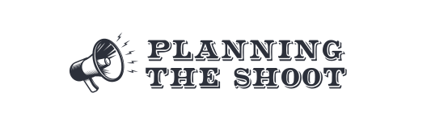

    

# PLANNING THE SHOOT

### Aplicación para el desglose de guión.

#### Idea y especificaciones
La aplicación en entorno WEB consistirá en poder subir un guión con un formato específico, escrito en word con formato .doc  
La app almacena y transforma el guión a un archivo .xml. A través de este formato se extraerá la información de cada secuencia, como el número, localización, ubicación y ambiente de luz; a mayores de los intérpretes de cada secuencia y la duración de esta en octavos.  

Con toda esta información se generará un entorno de trabajo para poder crear una planificación de grabación.

Esta aplicación se desarrollará con tecnología *python - Flask* en el servidor y *JS - React* en el cliente. Como base de datos se usará SQL en el entorno *MySql*.
La aplicación se alojará en un entorno Linux - Ubuntu.

